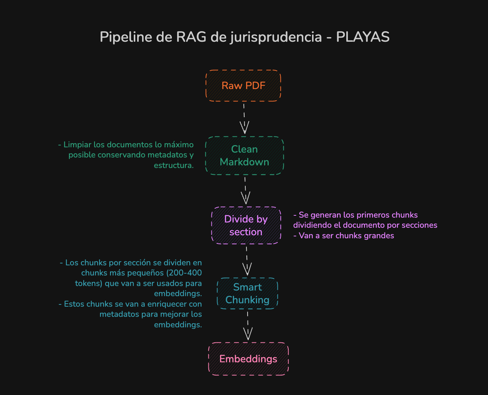
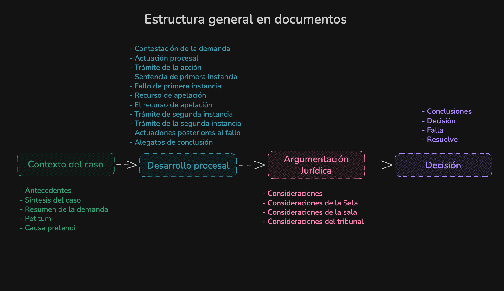

# RAG Playas

Sistema de **Recuperación Aumentada por Generación (RAG)** especializado en jurisprudencia sobre playas y bienes de uso público en Colombia. Procesa sentencias en PDF, las estructura semánticamente y expone una interfaz de consulta en lenguaje natural.

---

## Pipeline de ingesta



El pipeline transforma documentos PDF crudos en chunks semánticos listos para embeddings, pasando por cuatro etapas:

### 1. Raw PDF → Clean Markdown

Los PDFs se convierten a Markdown con **Docling** (OCR, tablas e imágenes). Sobre el Markdown resultante se aplica una limpieza exhaustiva: se eliminan encabezados de página, pies de página, numeraciones de folio y cualquier ruido tipográfico que introduzca tokens sin valor semántico. El objetivo es conservar únicamente el contenido sustantivo y la estructura de secciones del documento.

Las imágenes detectadas en el documento se extraen y almacenan en `data/bronze/images/`. No se incorporan al modelo de embeddings, pero quedan disponibles para que el usuario las consulte en la interfaz cuando el contexto recuperado las referencie.

### 2. Divide by Section

El Markdown limpio se segmenta en secciones usando expresiones regulares sobre los encabezados (`#`, `##`, `###`). Cada sección produce un **chunk grande** que contiene únicamente el texto de ese bloque temático. Estos chunks son la unidad de granularidad gruesa: preservan el contexto completo de cada parte del fallo sin mezclar información de secciones distintas.

### 3. Smart Chunking

Cada chunk de sección se subdivide en **subchunks de 200–400 tokens**, tamaño óptimo para los modelos de embeddings. Sobre cada subchunk, **Gemini** genera metadatos enriquecidos:

- Resumen conciso del fragmento.
- Palabras clave jurídicas relevantes.
- Tipo de sección a la que pertenece.

Este enriquecimiento mejora la precisión del retrieval al inyectar señal semántica explícita en cada chunk antes de calcular el embedding.

### 4. Embeddings

Los subchunks enriquecidos se vectorizan con **Ollama** (`embeddinggemma`) y se indexan en **ChromaDB**. El retriever combina búsqueda vectorial y BM25 con fusión por RRF (Reciprocal Rank Fusion) para maximizar la relevancia de los fragmentos recuperados.

---

## Estructura de los documentos



Se analizaron los documentos de cada carpeta TAM para identificar los títulos recurrentes en las sentencias. A partir de ese análisis se obtuvo la siguiente estructura general, común a la gran mayoría de los fallos:

| Bloque                     | Secciones habituales                                                                                                                                                                                                                                   |
| -------------------------- | ------------------------------------------------------------------------------------------------------------------------------------------------------------------------------------------------------------------------------------------------------ |
| **Contexto del caso**      | Antecedentes · Síntesis del caso · Resumen de la demanda · Petitum · Causa petendi                                                                                                                                                                     |
| **Desarrollo procesal**    | Contestación de la demanda · Actuación procesal · Trámite de la acción · Sentencia de primera instancia · Fallo de primera instancia · Recurso de apelación · Trámite de segunda instancia · Actuaciones posteriores al fallo · Alegatos de conclusión |
| **Argumentación jurídica** | Consideraciones · Consideraciones de la Sala · Consideraciones del tribunal                                                                                                                                                                            |
| **Decisión**               | Conclusiones · Decisión · Falla · Resuelve                                                                                                                                                                                                             |

Esta taxonomía guía la etapa _Divide by Section_: los encabezados detectados en cada documento se mapean a uno de estos cuatro bloques, lo que garantiza que el contenido semánticamente relacionado quede en el mismo chunk de sección, independientemente de las variaciones de nomenclatura entre fallos.

---

## Estructura del proyecto

```
rag_playas/
├── pyproject.toml
├── uv.lock
├── .python-version
├── .env.example
├── Makefile
│
├── data/
│   ├── raw/             ← PDFs originales
│   ├── bronze/          ← Markdown limpio (con imágenes en bronze/images/)
│   ├── silver/          ← documentos normalizados (JSONL por archivo)
│   │   └── chunked/     ← chunks por sección
│   └── gold/            ← chunks enriquecidos (resumen, keywords, tipo de sección)
│
├── src/
│   ├── config.py        ← configuración centralizada desde variables de entorno
│   ├── ingest/
│   │   ├── pdf_to_md.py ← convierte PDFs (raw) a Markdown (bronze)
│   │   ├── loaders.py   ← carga Markdown de bronze y genera capa silver
│   │   ├── normalize.py ← limpieza y normalización de metadata
│   │   ├── splitter.py  ← divide documentos en chunks por sección
│   │   └── enrich.py    ← smart chunking + enriquecimiento con Gemini (capa gold)
│   ├── backend/
│   │   ├── embeddings.py   ← cliente Ollama compartido
│   │   ├── vectorstore.py  ← construye/actualiza la colección en Chroma
│   │   ├── retriever.py    ← BM25 + vectorial + reranker (RRF)
│   │   └── generator.py    ← cadena RAG (retriever + Gemini)
│   └── frontend/
│       └── gradio_app.py   ← interfaz de chat
│
├── docs/
│   └── images/          ← diagramas del pipeline y estructura de documentos
│
├── scripts/
│   ├── ec2_chroma_db.sh
│   ├── ec2_ollama_embeddings.sh
│   └── run_pipeline.sh  ← pipeline completo de un solo comando
│
├── tests/
│   ├── unit/
│   └── integration/
│
└── evaluation/
    ├── ragas_eval_gemma.py
    └── ragas_eval_ollama.py
```

---

## Compatibilidad

Diseñado para ejecutarse en **Linux**. Los scripts `.sh` asumen `apt-get` y Docker disponibles.

**Windows con WSL** es compatible con conversión previa de saltos de línea:

```bash
sudo apt-get install -y dos2unix
dos2unix scripts/*.sh
```

---

## Requisitos

- Python 3.12+
- [`uv`](https://docs.astral.sh/uv/) — gestor de dependencias y entornos virtuales
- Docker — para ChromaDB
- Ollama — para embeddings
- API Key de Google — para **Gemini**

---

## Instalación

```bash
# Instalar uv (una vez)
curl -LsSf https://astral.sh/uv/install.sh | sh

# Clonar el repositorio
git clone https://github.com/jpospinalo/rag_playas.git
cd rag_playas

# Instalar dependencias (crea .venv automáticamente)
uv sync

# Incluir dependencias de desarrollo
uv sync --dev

# Copiar y completar las variables de entorno
cp .env.example .env
```

---

## Infraestructura en AWS

Antes de ejecutar el pipeline se necesitan dos instancias EC2. Se recomienda asignar una **IP elástica** a cada una para estabilizar las variables de entorno.

### EC2 — ChromaDB

```bash
bash scripts/ec2_chroma_db.sh
```

Lanza ChromaDB en Docker con persistencia en `/opt/chroma-data`, expuesto en el puerto `8000`.

### EC2 — Ollama (embeddings)

```bash
bash scripts/ec2_ollama_embeddings.sh
```

Lanza Ollama en Docker en el puerto `11434` y descarga el modelo `embeddinggemma`.

### Variables de entorno

```dotenv
# ChromaDB (EC2)
CHROMA_HOST=<ip-elastica-chroma>
CHROMA_PORT=8000
CHROMA_COLLECTION=rag_playas

# Ollama (EC2)
OLLAMA_BASE_URL=http://<ip-elastica-ollama>:11434
OLLAMA_EMBEDDING_MODEL=embeddinggemma
```

> Los grupos de seguridad deben permitir tráfico entrante en los puertos `8000` y `11434` desde la IP de la máquina que ejecuta el pipeline.

---

## Ejecución del pipeline

```bash
# 1) PDF → Markdown limpio  →  data/bronze/
uv run python -m src.ingest.pdf_to_md

# 2) Normalización           →  data/silver/
uv run python -m src.ingest.loaders

# 3) Chunks por sección      →  data/silver/chunked/
uv run python -m src.ingest.splitter

# 4) Smart chunking + gold   →  data/gold/
uv run python -m src.ingest.enrich

# 5) Indexar en ChromaDB
uv run python -m src.backend.vectorstore

# 6) Interfaz Gradio
uv run python -m src.frontend.gradio_app
```

O ejecutar todo de un solo comando:

```bash
bash scripts/run_pipeline.sh
```

La interfaz queda disponible en `http://0.0.0.0:7860`.

---

## Comandos útiles

```bash
make install        # instalar dependencias
make lint           # verificar estilo con ruff
make format         # formatear código
make test           # tests unitarios
make test-cov       # tests + cobertura
make pipeline       # ingestar documentos
make app            # lanzar Gradio
make help           # ver todos los comandos
```
