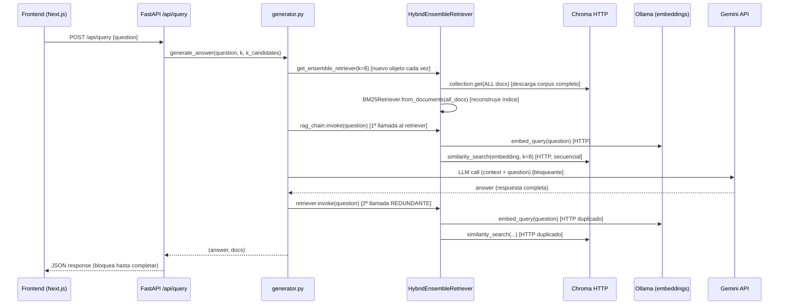
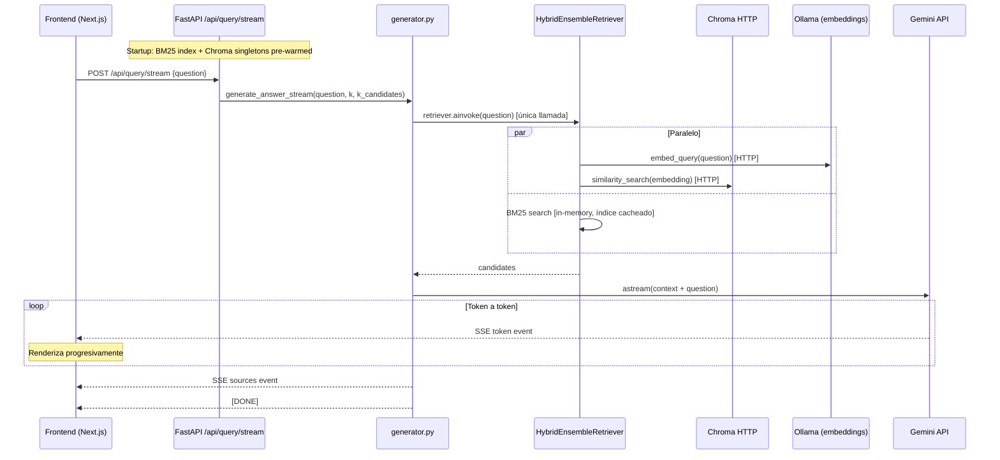

# Mejoras de rendimiento: POST /api/query

Fecha de implementación: Abril 2026

## Contexto

El endpoint `POST /api/query` es el único punto de entrada del sistema para responder preguntas desde el frontend. Se identificaron seis problemas de rendimiento que causaban latencia innecesaria en cada petición.

---

## Flujo antes de las mejoras



---

## Problemas identificados y soluciones aplicadas

### 1. Doble invocación del retriever — CRÍTICO

**Archivos afectados:** `rag/core/generator.py`

**Problema:** `generate_answer` invocaba el retriever híbrido dos veces: una dentro del `rag_chain.invoke()` (para generar el contexto) y otra con `retriever.invoke()` (para obtener los documentos fuente). Cada invocación ejecutaba la búsqueda BM25, el embedding en Ollama y la consulta vectorial en Chroma.

**Solución:** Se eliminó la cadena LangChain en `generate_answer`. Ahora el flujo es explícito: se llama al retriever una sola vez, se construye el contexto, y se pasa directamente a `prompt | llm | StrOutputParser()`.

```python
# Antes (dos invocaciones)
answer = rag_chain.invoke(question)          # retriever invocado aquí
candidates = retriever.invoke(question)      # retriever invocado de nuevo

# Después (una sola invocación)
candidates = retriever.invoke(question)
context = _build_context_block(candidates)
answer = (prompt | llm | StrOutputParser()).invoke({"context": context, "question": question})
```

---

### 2. Reconstrucción del índice BM25 en cada request — CRÍTICO

**Archivos afectados:** `rag/core/retriever.py`, `rag/api/main.py`

**Problema:** `get_bm25_retriever()` llamaba a `load_all_docs_from_chroma()` en cada request, descargando el corpus completo de Chroma por HTTP y reconstruyendo el índice `BM25Okapi` desde cero. Combinado con la doble invocación (problema 1), esto ocurría cuatro veces por petición.

**Solución:** Se introdujo un singleton `_bm25_base` (módulo-level) y una función `_get_bm25_base()` que descarga el corpus y construye el índice una única vez. Las llamadas posteriores a `get_bm25_retriever(k)` hacen un `model_copy(update={"k": k})` (coste despreciable) sin tocar el índice.

El índice se pre-calienta al arrancar el servidor mediante el evento `lifespan` de FastAPI, que llama a `init_retrievers()` en un hilo para no bloquear el event loop:

```python
@asynccontextmanager
async def lifespan(app: FastAPI):
    await asyncio.to_thread(init_retrievers)
    yield
```

---

### 3. Sub-retrievers ejecutados secuencialmente — ALTO

**Archivos afectados:** `rag/core/retriever.py`

**Problema:** `HybridEnsembleRetriever._get_relevant_documents` invocaba BM25 y la búsqueda vectorial en un `for` secuencial. Como ambas operaciones son independientes (BM25 es CPU-bound, la búsqueda vectorial es IO-bound vía HTTP a Ollama y Chroma), podían ejecutarse en paralelo.

**Solución:** Se reemplazó el bucle secuencial por un `ThreadPoolExecutor` con dos workers:

```python
# Antes
all_results = [r.invoke(query) for r in self.retrievers]

# Después
with ThreadPoolExecutor(max_workers=len(self.retrievers)) as pool:
    futures = [pool.submit(r.invoke, query) for r in self.retrievers]
    all_results = [f.result() for f in futures]
```

---

### 4. Sin streaming hacia el frontend — MEDIO (impacto de UX)

**Archivos afectados:** `rag/core/generator.py`, `rag/api/main.py`, `frontend/lib/api.ts`, `frontend/hooks/useChat.ts`, `frontend/lib/types.ts`

**Problema:** El endpoint devolvía la respuesta completa en JSON una vez que Gemini terminaba de generar. El usuario esperaba sin ver ningún progreso hasta que la respuesta estaba lista.

**Solución:** Se añadió un nuevo endpoint `POST /api/query/stream` que emite eventos SSE (Server-Sent Events) usando `StreamingResponse`. El generador asíncrono `generate_answer_stream` en `generator.py` invoca el retriever una vez y luego hace `llm.astream()` para emitir tokens en tiempo real.

Formato de los eventos SSE:
```
data: {"type": "token",   "content": "<fragmento de texto>"}
data: {"type": "sources", "sources": [...]}
data: [DONE]
```

En el frontend, `queryRagStream` en `lib/api.ts` es un generador asíncrono que consume el stream con `ReadableStream` + `TextDecoder`. `useChat.ts` inserta un mensaje asistente vacío antes del primer token y lo actualiza progresivamente:

```typescript
const assistantId = crypto.randomUUID();
setMessages((prev) => [...prev, { id: assistantId, role: "assistant", text: "", sources: [] }]);

for await (const event of queryRagStream({ question: q })) {
  if (event.type === "token") {
    setMessages((prev) =>
      prev.map((m) => m.id === assistantId ? { ...m, text: m.text + event.content } : m)
    );
  } else if (event.type === "sources") {
    setMessages((prev) =>
      prev.map((m) => m.id === assistantId ? { ...m, sources: event.sources } : m)
    );
  }
}
```

El endpoint `POST /api/query` (JSON) se mantiene para compatibilidad.

---

### 5. `build_rag_chain()` recreaba objetos en cada request — MEDIO

**Archivos afectados:** `rag/core/generator.py`

**Problema:** `build_rag_chain()` recreaba el `prompt`, la chain LangChain y el ensemble retriever en cada petición. Solo el LLM estaba cacheado con `@lru_cache`.

**Solución:** Con el rediseño de `generate_answer` (problema 1), `build_rag_chain` dejó de usarse en el flujo principal. El ensemble retriever usa componentes cacheados (problema 2), y la chain `prompt | llm | StrOutputParser()` es trivial de construir (sin coste de red ni de cómputo).

---

### 6. Cliente Chroma instanciado repetidamente — BAJO

**Archivos afectados:** `rag/core/retriever.py`

**Problema:** Tanto `load_all_docs_from_chroma()` como `get_vector_retriever()` creaban un nuevo `chromadb.HttpClient` en cada llamada, sin reutilizar la conexión TCP.

**Solución:** Se introdujeron singletons `_chroma_client` y `_chroma_vectorstore` a nivel de módulo con sus funciones de acceso `_get_chroma_client()` y `_get_chroma_vectorstore()`. Ambos se pre-calientan en `init_retrievers()`.

---

## Flujo después de las mejoras



---

## Archivos modificados

| Archivo | Cambio principal |
|---|---|
| `rag/core/retriever.py` | Singletons de Chroma, índice BM25 cacheado, sub-retrievers en paralelo |
| `rag/core/generator.py` | Una sola invocación del retriever, generador asíncrono `generate_answer_stream` |
| `rag/api/main.py` | Lifespan de FastAPI para pre-calentar, endpoint SSE `/api/query/stream` |
| `frontend/lib/types.ts` | Tipos `StreamEvent` para SSE |
| `frontend/lib/api.ts` | Función `queryRagStream` (generador asíncrono SSE) |
| `frontend/hooks/useChat.ts` | Rendering progresivo con streaming |
