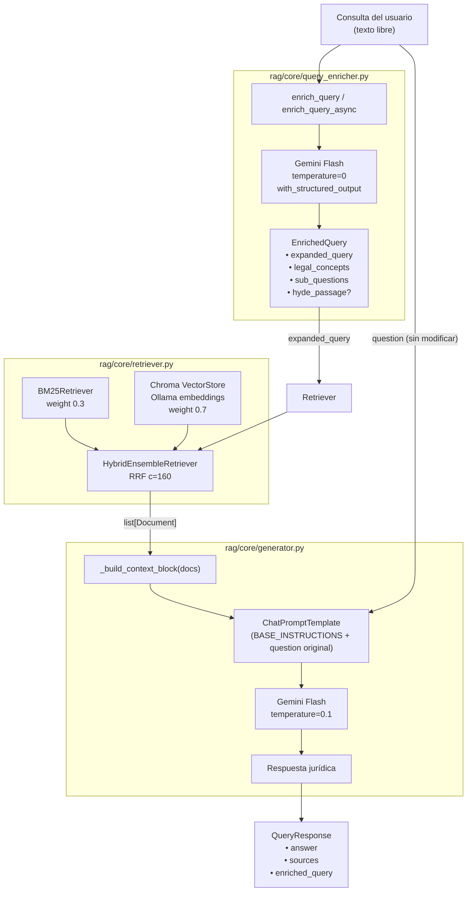

# Query Enrichment — Arquitectura

## Resumen

Antes de que la consulta del usuario llegue al retriever híbrido, un paso de **enriquecimiento con LLM** la reescribe en una cadena de búsqueda más rica en terminología jurídica. Esto mejora el recall de ambas patas del retriever: BM25 (coincidencia de términos exactos) y la búsqueda vectorial densa (framing semántico más preciso).

La **pregunta original** del usuario nunca se modifica: sigue siendo la que se inyecta en el prompt de generación final, preservando la intención exacta del abogado.

---

## Flujo completo



---

## Schema `EnrichedQuery`

Definido en `rag/core/query_enricher.py` como modelo Pydantic:

| Campo | Tipo | Descripción |
|---|---|---|
| `expanded_query` | `str` | Cadena de búsqueda enriquecida (50–120 tokens) con terminología jurídica precisa, sinónimos legales e instituciones relevantes. Se usa en `retriever.invoke(...)`. |
| `legal_concepts` | `list[str]` | 1–3 etiquetas del tipo de problema jurídico identificado. Ver vocabulario abajo. |
| `sub_questions` | `list[str]` | 0–3 sub-preguntas que descomponen la consulta en aspectos independientes. Lista vacía si la consulta ya es específica. |
| `hyde_passage` | `str \| None` | Fragmento hipotético de sentencia (HyDE). Solo se genera si `QUERY_ENRICHMENT_HYDE=true`. |

### Vocabulario de `legal_concepts`

```
deslinde_amojonamiento
concesion_permiso
acceso_publico
sancion_administrativa
licencia_ambiental
dominio_publico_bienes_uso_publico
servidumbre_transito
construccion_edificacion
uso_aprovechamiento
competencia_jurisdiccion
```

---

## Prompt de enriquecimiento

### System

```
Eres un experto en jurisprudencia colombiana sobre playas, zonas costeras,
dominio público marítimo-terrestre y bienes de uso público.

Tu única tarea es enriquecer consultas jurídicas para mejorar la recuperación
de documentos en un sistema RAG especializado en sentencias del Consejo de Estado
y Tribunales Administrativos colombianos. NO respondas la consulta.
```

### Human (template)

```
Dada la siguiente consulta de un abogado, produce un objeto JSON con estos campos:

1. `expanded_query`: cadena de búsqueda enriquecida (50–120 tokens) que combine
   la consulta original con términos jurídicos precisos del derecho colombiano de costas.
   Incluye sinónimos legales, nombres de instituciones relevantes (Consejo de Estado,
   Tribunal Administrativo, DIMAR, ANLA, Superintendencia de Notariado),
   normas clave (Decreto 2811/1974, Ley 99/1993, Código Civil arts. 674-677)
   y conceptos directamente relacionados con el problema planteado.

2. `legal_concepts`: lista de 1–3 etiquetas que clasifiquen el tipo de problema jurídico.

3. `sub_questions`: 0–3 sub-preguntas focalizadas que descompongan la consulta.
   Omitir si la consulta ya es específica.

[4. `hyde_passage` — solo si QUERY_ENRICHMENT_HYDE=true]

Consulta: {question}
```

---

## Estrategias de enriquecimiento implementadas

### 1. Expansión de terminología legal

Transforma lenguaje coloquial en términos jurídicos que aparecen en el corpus indexado.

> **Consulta:** `"¿quién decide si se puede construir en la playa?"`
>
> **expanded_query:** `"autoridad competente licencia construcción zona de playa dominio público
> Consejo de Estado concesión permiso deslinde amojonamiento Decreto 2811 ANLA"`

**Impacto:** Mejora drásticamente el recall de BM25, que actualmente tiene peso 0.3 pero pierde tokens cuando el usuario habla de forma informal.

### 2. Clasificación del concepto jurídico

Identifica la categoría del problema para anclar la consulta al cluster jurisprudencial correcto. La etiqueta se incorpora dentro del `expanded_query`.

### 3. Descomposición en sub-preguntas

Para consultas compuestas, genera preguntas focalizadas que cubren distintos ángulos de recuperación.

> **Consulta:** `"¿puede el municipio cerrar el acceso a una playa privada?"`
>
> **sub_questions:**
> 1. `¿Las playas son bienes de uso público en Colombia?`
> 2. `¿Tiene el municipio competencia para restringir el acceso a zonas costeras?`
> 3. `¿Qué establece el Consejo de Estado sobre el acceso a playas frente a propietarios privados?`

> **Nota:** En la implementación actual, el `expanded_query` ya incorpora el contenido semántico de las sub-preguntas. Un paso futuro puede usar cada sub-pregunta como consulta de recuperación independiente y fusionar resultados.

### 4. HyDE — Hypothetical Document Embedding (opcional)

Genera un fragmento hipotético de sentencia que podría existir en el corpus. Mejora la búsqueda vectorial para consultas muy abstractas o inusuales.

**Activar:** `QUERY_ENRICHMENT_HYDE=true`

**Latencia adicional:** ~100–200 ms (tokens extra en el output del LLM de enriquecimiento).

---

## Configuración

Variables de entorno (ver `.env.example`):

| Variable | Valor por defecto | Descripción |
|---|---|---|
| `QUERY_ENRICHMENT_ENABLED` | `true` | Activa/desactiva el paso de enriquecimiento. Con `false`, se usa la consulta original sin modificar. |
| `QUERY_ENRICHMENT_HYDE` | `false` | Activa la generación del fragmento hipotético (HyDE). |

---

## Presupuesto de latencia

| Paso | Estimación |
|---|---|
| Enriquecimiento (Gemini Flash, ~200 tokens de salida) | ~300–500 ms |
| Recuperación híbrida BM25 + vector (sin cambios) | ~200–400 ms |
| Generación final (sin cambios) | ~1–3 s |

El enriquecimiento ocurre antes de la recuperación y se ejecuta en el mismo hilo (síncrono) o como coroutine (asíncrono en el endpoint de streaming). El overhead total sobre el pipeline existente es de aproximadamente **400 ms**.

Para el endpoint de streaming (`/api/query/stream`), el enriquecimiento completa antes de que se emita el primer token, por lo que el inicio del stream se retrasa en ese margen.

---

## Archivos relevantes

| Archivo | Rol |
|---|---|
| `rag/core/query_enricher.py` | Módulo de enriquecimiento: schema `EnrichedQuery`, prompt, funciones `enrich_query` y `enrich_query_async` |
| `rag/core/generator.py` | Orquestación: llama al enriquecedor antes del retriever, pasa `expanded_query` a recuperación y `question` original al LLM |
| `rag/api/schemas.py` | Añade `enriched_query: str \| None` a `QueryResponse` |
| `rag/api/main.py` | Expone `enriched_query` en la respuesta JSON y en el evento SSE de fuentes |
| `.env.example` | Documenta las variables `QUERY_ENRICHMENT_ENABLED` y `QUERY_ENRICHMENT_HYDE` |

---

## Mecanismo de fallback

Si el LLM de enriquecimiento falla por cualquier motivo (error de red, respuesta malformada, timeout), `enrich_query` captura la excepción, emite un warning en el log y devuelve un `EnrichedQuery` con `expanded_query` igual a la pregunta original. El pipeline continúa sin interrupción.
